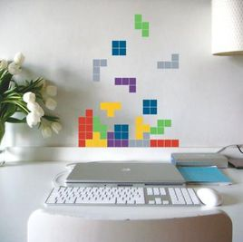
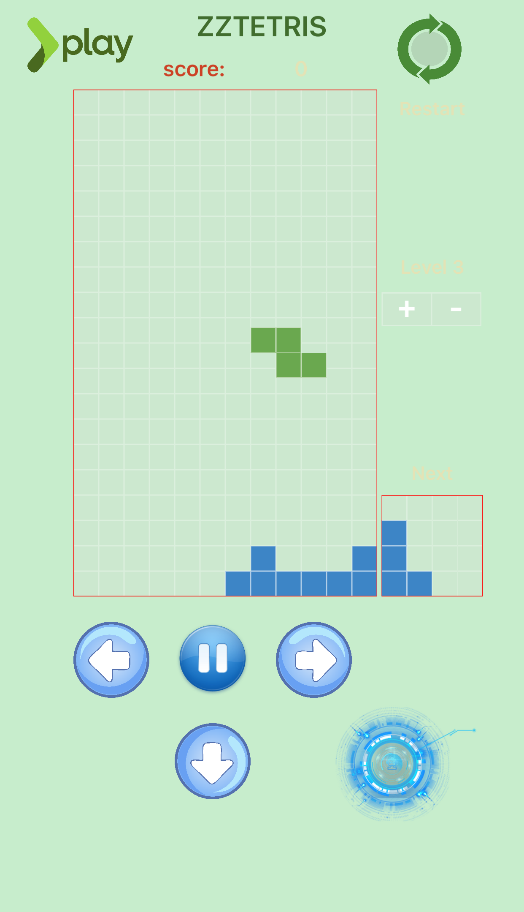

#  ZZTetris
-

- 想要的俄罗斯方块

- 实现的俄罗斯方块 

###游戏格子盘

- 首先，定义游戏格子盘是由120x200像素的二维面板，面板又由10x10的格子组成。
- 其次，抽出基准值为10，10x10的格子看成1x1，盘子看成12x20。
- 绘制游戏格子盘，绘制240（12x20）个规格为1x1的的格子。
- 第三，先绘制盘子（UIView），再用两个for循环绘制240个小格子（UIView）放置在盘子（UIView）上。

###方块类型、颜色、初始位置

- 依据经典，得知8种基本类型，以及旋转产生的衍生类型11种，总共19种，使用一个类型枚举。
- 每种类型方块都是由4个小格子组成，在二维上确定每种类型方块的4个格子的二维左边，然后用一个数组存储该4个坐标。
- 方块类型随机产生，随机数为0-18，分别对应19种类型。
- 方块颜色随机产生，随机数为0-3，有红蓝黄绿4种颜色共随机，但该方块的4个格子颜色一致。
- 方块初始位置随机，根据盘子（12x20）的x轴的0-12来随机。

###方块存储

- 首先，预生成方块，即下一个将要下落的方块，数组A存储。有两个作用：
	+ 提示用户下个方块类型
	+ 直接提取给数组B使用
- 其次，生成方块，即当前正在下落的方块，数组B存储。直接从数组A拿取方块。
- 第三，所有已停止下落的方块，用数组C存储。当数组B中的方块下落停靠时，将数组B中的方块移动到数组C中，同时将数组A中的方块移动到数组B：
	+ B（当前下落方块） -> C（所有停靠方块）; 
	+ A（将要下落方块） -> B（当前下落方块）;
	+ [方块 new] -> A（将要下落方块）

###方块移动

- 正常下落。游戏开始，定时器设定当前下落方块，下落1格/0.1s。当判断下一格（x = x，y = y+1）在数组C中，则停止下落；同时生成新的方块，继续定时下落。
- 左移、右移。若判断左一个（x=x-1,y=y）或右一个（x=x+1,y=y）在数组C中，则停止左右移动。
- 加速下落。生成一个数字，比如5，则让该方块在0.1s进行五次正常下落。
- 旋转。旋转会产生类型变化以及方块的重心偏移：
	+ 使用变化后的类型方块
	+ 依据旧方块位置，修改新方块的整体偏移位置
	+ 计算出新方块的4个格子的二维坐标
	+ 判断新方块是否会与数组C相交，若相交，停止旋转操作。
	+ 若不相交，则用新方块代替旧方块，同时数组B更替，UI也更替。

- 因以上五种移动操作，都是对当前方块UI操作，因为需要添加锁进行保护。

###方块消层

- 在方块停靠时，for循环判断y轴从19-0层，数组C中的格子能否填满该层，能则移除这一层。同时计算消层之后，需要下落的高度。以及计算该次消层的总层数x100 = 分数，累计后得出总分数并显示。

###其它

- 游戏速度选项
- 游戏结束提醒
- 再玩一次提醒
- 再玩一次按钮选项
- 整体布局调整，向经典看齐
- 整体颜色调整，让眼睛舒服
